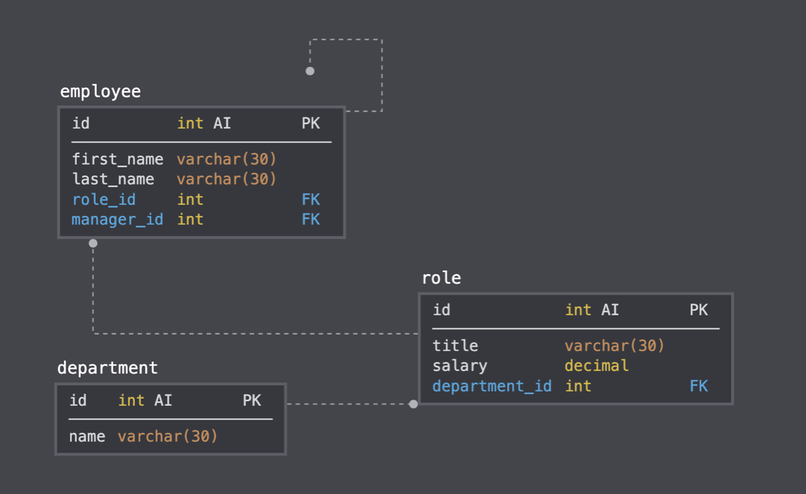

# EmployeeTracker
Bootcamp Assignment 12

# Details 
This assignment required the creation of a command-line application that would use inquirer and mysql to all employers to view their current departments, employees, and roles. It also allows them to update current employees and add departments, employees, and roles.

# Features
This application includes 
- Use of inquirer
- Use of MySQL 
- User input to view and manage the departments, roles, and employees in their company  

# Usage 
- Beginning with the code, node app.js, a user can be prompted to manage or change company information

# GIF of Application

 
